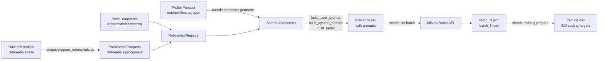

# recode-scenario

Generate synthetic French clinical discharge scenarios from PMSI data, submit
them to a Mistral batch job, and assemble fine-tuning datasets for an ICD-10
coding model.

Each scenario combines a statistical profile drawn from the French national
hospital claims database (*Base nationale PMSI*) with a clinical narrative
template and ATIH coding rules. A Mistral batch pipeline expands these prompts
into complete synthetic discharge reports. A post-processing step extracts ICD
coding targets and writes a training-ready CSV.

The pipeline is entirely deterministic: given the same profile file and seed,
it produces byte-equivalent output at every run.

## Architecture at a glance



Key files per step:

| Step | Entry point | Output |
|---|---|---|
| Prepare referentials | `scripts/prepare_referentials.py` | `referentials/processed/*.parquet` |
| Generate scenarios | `recode scenarios generate` | `runs/*/scenarios.csv` |
| Run Mistral batch | `recode llm batch` | `runs/*/batches/batch_N.json` |
| Prepare training data | `recode training prepare` | `runs/*/training.csv` |

## Install

```bash
git clone https://github.com/24p11/recode-scenario.git
cd recode-scenario
uv sync
cp .env.example .env   # then set RECODE_MISTRAL_API_KEY
```

Python 3.12 is required. All dependencies are managed via [uv](https://docs.astral.sh/uv/).

## Quickstart

```bash
# 1. One-shot: convert raw referentials to Parquet
uv run python scripts/prepare_referentials.py

# 2. Generate 1 000 scenarios from a classification profile file
uv run recode scenarios generate \
    --profile-file data/profiles.parquet \
    --n 1000 --seed 42 \
    --out runs/2026-04-15/scenarios.csv

# 3. Submit to Mistral batch and download outputs
uv run recode llm batch \
    --scenarios runs/2026-04-15/scenarios.csv \
    --out runs/2026-04-15/batches/

# 4. Aggregate LLM outputs into a training-ready CSV
uv run recode training prepare \
    --job-dir runs/2026-04-15/batches/ \
    --out runs/2026-04-15/training.csv
```

Step 1 is a one-time operation per source update. Steps 2-4 are the normal
operational loop. Secrets (API key) live in `.env`; operational parameters
(model name, batch size, poll interval) live in `config/default.yaml`.

## Repo layout

```
recode-scenario/
├── src/recode/          # Installable Python package (recode)
│   ├── cli/             # Typer entry points: scenarios, llm, training
│   ├── scenarios/       # Deterministic scenario generation (pure functions)
│   ├── llm/             # Mistral batch I/O
│   ├── training/        # LLM output → training CSV
│   ├── referentials/    # Typed Parquet + YAML access via ReferentialRegistry
│   ├── models/          # Pydantic v2 domain models
│   ├── config.py        # Settings (pydantic-settings, RECODE_ prefix)
│   └── logging.py       # Loguru setup
├── scripts/             # Operational scripts (prepare, build, generate, compare)
├── referentials/
│   ├── raw/             # Source files (Excel, CSV, TXT, OWL) — gitignored large files
│   ├── processed/       # Generated Parquet files (committed)
│   └── constants/       # YAML constant sets (cancer codes, DRG categories, …)
├── templates/           # System prompt templates (.txt) + ATIH coding rules (.yml)
├── tests/
│   ├── unit/            # Unit tests (~100 tests across all subpackages)
│   ├── regression/      # Golden-file regression tests against legacy baseline
│   ├── integration/     # End-to-end CLI test
│   └── fixtures/        # Synthetic profiles Parquet + mini referentials
├── config/
│   └── default.yaml     # Operational parameters (versioned)
├── docs/                # Architecture notes and developer guide
└── arXiv/legacy_v2/     # Pre-refacto monolithic code (read-only reference)
```

## Key subpackages

| Subpackage | Role |
|---|---|
| `scenarios/` | Assembles `Scenario` objects from `Profile` rows using pure, RNG-threaded functions. Deterministic given `(profile, base_seed)`. |
| `llm/` | Wraps the Mistral batch API: JSONL serialization, upload, polling, download, retry with tenacity. |
| `training/` | Parses LLM JSON responses, extracts ICD coding targets, merges with scenario inputs to produce a training CSV. |
| `referentials/` | `ReferentialRegistry` provides lazy, Pandera-validated, cached access to every Parquet and YAML constant file. |
| `models/` | Pydantic v2 domain models: `Profile`, `Scenario`, `Patient`, `Stay`, `Diagnosis`, `Procedure`, `CancerContext`, `CodingRule`, `TreatmentRecommendation`. |
| `cli/` | Typer application with three sub-commands: `recode scenarios generate`, `recode llm batch`, `recode training prepare`. |

## Development

```bash
uv run pytest                    # full test suite
uv run pytest -m "not slow"      # skip integration tests
uv run pytest -m regression      # regression tests only
uv run ruff check src/ tests/ scripts/
uv run ruff format src/ tests/ scripts/
uv run mypy src/recode
uv run pre-commit install        # install git hooks
```

Coverage is measured on every `pytest` run (`--cov=src/recode`). The target is
85%; the CI gate enforces this. For more detail see `docs/dev_guide.md`.

## More info

- Developer guide (internals, playbooks, testing strategy): `docs/dev_guide.md`
- Architecture overview: `docs/architecture.md`

---

## Domain reference

### Variables dictionary

- `drg_code`
- `drg_description`
- `drg_parent_code`
- `drg_parent_code_description`
- `icd_code`
- `icd_code_description`
- `icd_parent_code`
- `icd_parent_code_description`
- `icd_primary_code` — principal diagnosis
- `icd_primary_code_definition` — principal diagnosis definition
- `icd_secondary` — related diagnosis
- `cage` — age classes `[0-1[`, `[1-5[`, `[5-10[`, `[10-15[`, `[15-18[`, `[18-30[`, `[30-40[`, `[40-50[`, `[50-60[`, `[60-70[`, `[70-80[`, `[80-[`
- `cage2` — age classes `[0-1[`, `[1-5[`, `[5-10[`, `[10-15[`, `[15-18[`, `[18-50[`, `[50-[`
- `sexe` — 1 (M) / 2 (F)
- `admission_mode`
- `discharge_disposition`
- `admission_type`

### Table `classification_profile`

- `drg_parent_code`
- `icd_primary_code`
- `icd_primary_parent_code`
- `case_management_type`
- `cage`
- `cage2`
- `sexe`

### Table `secondary_diagnosis`

- `drg_parent_code`
- `icd_primary_parent_code`
- `cage2`
- `sexe`

### Cancer — synthetic treatment recommendation table

- `primary_site`
- `histological_type`
- `Stage`
- `TNM_score`
  - `T` — tumour (TNM)
  - `N` — nodes (TNM)
  - `M` — metastasis (TNM)
- `biomarkers`
- `treatment_recommandation`
- `chemotherapy_regimen`

Use the `col_names` options of the project's load functions to align the column
names of source files with this dictionary.

### PMSI / English glossary

| French PMSI term | English equivalent | Notes / Context |
|---|---|---|
| `Résumé PMSI` | Patient-level coded abstract / Discharge abstract | Structured data for each hospitalisation — ICD diagnoses, procedures, demographics. |
| `Code diagnostic principal (DP)` | Primary diagnosis (`ICD code`) | Main reason for hospitalisation. |
| `Codes diagnostics associés (DAS)` | Secondary diagnoses (`ICD codes`) | Comorbidities or complications during the stay. |
| `Actes` | Procedures / `ICD procedure codes` | Coded interventions performed during hospitalisation. |
| `GHM (Groupe Homogène de Malades)` | `DRG (Diagnosis-Related Group)` | Classification for resource use / reimbursement purposes. |
| `CMD (Catégorie Majeure de Diagnostic)` | `MDC (Major Diagnostic Category)` | Top-level DRG grouping by body system or disease category. |
| `Données de séjour` vs `Données de patient` | `Case-level data` vs `Patient-level data` | Individual hospitalisation record used for DRG assignment or analysis. |
| `Mode entrée` | `Admission mode` | How the patient was admitted to the hospital. |
| `Mode de sortie` | `Discharge disposition` | How the patient was discharged, including deceased. |
| `Mode d'hospitalisation` | `Type of admission` | Inpatient vs outpatient admission. |
| Variables normalisées | Normalized variables / Standardised coded fields | Coded fields derived from the patient record (ICD, procedures, demographics). |

### Hospitalisation management type

A clinical abstraction derived from the combination of the principal diagnosis
(`DP`) and the linked diagnosis (`DR`). This combination determines the DRG
assignment and reflects the patient's management mode during the hospital stay.

Management types follow the ATIH coding rules — see the recap table
[Guide Situations cliniques](https://docs.google.com/spreadsheets/d/1XRVeSn3VFSaM8o7bJYz7gGcyAFWN9Gn7Ko4x-tAOYjs/edit?usp=sharing).

**Management types for chronic diseases**

| Cancer | Diabetes | Other chronic diseases |
|---|---|---|
| Hospital admission with initial diagnosis of the cancer | Hospital admission with initial diagnosis of diabetes | Hospital admission with initial diagnosis of the disease |
| Hospital admission for cancer workup | Hospital admission for diabetes initial workup | Hospital admission for diagnostic workup |
| Hospital admission for initiation of treatment | Hospital admission for initiation of treatment of the diabetes | Hospital admission for initiation of treatment |
| Hospital admission for relapse or recurrence of the cancer | Hospital admission for change in therapeutic strategy | Hospital admission for acute exacerbation of the disease |
| Hospital admission for surgery | | |
