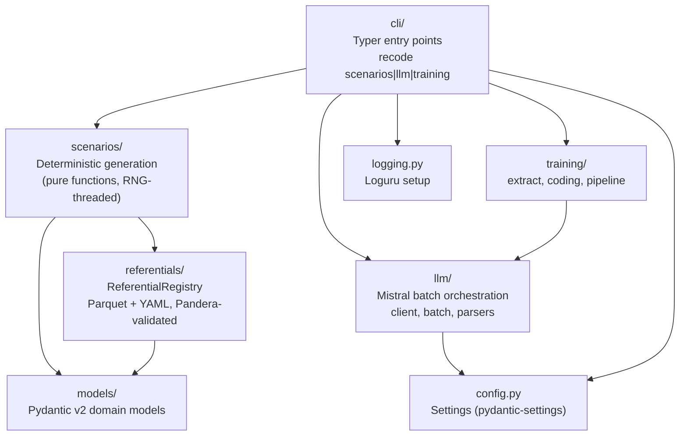

# Developer Guide

This guide is for developers joining the team who need to understand the
codebase, make changes, run tests, and add features.

---

## Table of Contents

1. [Onboarding](#1-onboarding)
2. [Core architecture](#2-core-architecture)
3. [Data model](#3-data-model)
4. [Scenario generation deep dive](#4-scenario-generation-deep-dive)
5. [LLM batch orchestration](#5-llm-batch-orchestration)
6. [Training data preparation](#6-training-data-preparation)
7. [Testing strategy](#7-testing-strategy)
8. [Config and logging](#8-config-and-logging)
9. [CIM-10 enrichment](#9-cim10-enrichment)
10. [Operational playbooks](#10-operational-playbooks)
11. [Commit and PR conventions](#11-commit-and-pr-conventions)
12. [Legacy archive](#12-legacy-archive)
13. [Out of scope / future work](#13-out-of-scope--future-work)

---

## 1. Onboarding

### Prerequisites

- Python 3.12 (managed by `.python-version` in the repo root)
- [uv](https://docs.astral.sh/uv/) — package and virtualenv manager
- A Mistral API key if you intend to run the LLM batch steps

### One-shot setup

```bash
git clone https://github.com/24p11/recode-scenario.git
cd recode-scenario
uv sync                  # creates .venv, installs all deps including dev group
cp .env.example .env     # then edit RECODE_MISTRAL_API_KEY with a real key
```

`uv sync` reads `pyproject.toml` and the lock file (`uv.lock`). Do not use
`pip install` directly.

For a containerized setup (runs the whole pipeline in Docker with host
volumes for `data/` and `runs/`), see `docs/docker.md`.

### Running the test suite

```bash
uv run pytest                         # full suite with coverage
uv run pytest -m "not slow"           # skip the integration test (fastest)
uv run pytest -m regression           # regression tests only
uv run pytest -m "not network"        # skip any tests that make real API calls
uv run pytest -k "cim10"             # filter by name substring
uv run pytest tests/unit/scenarios/   # one subdirectory
```

Coverage is reported to the terminal on every run. The CI gate requires ≥ 85%.
The current measured value is approximately 88%.

### Pre-commit hooks

The repo ships a `.pre-commit-config.yaml` with four hook groups:

- `pre-commit-hooks`: trailing whitespace, end-of-file fixer, YAML/TOML
  syntax, large file guard (6 MB), merge conflict markers, private key detector.
- `ruff`: lint with auto-fix (`--fix`), applied to `src/`, `tests/`, `scripts/`.
- `ruff-format`: auto-formatter, same scope.
- `mypy`: type checking of `src/recode/` using `pyproject.toml` config.

Install once:

```bash
uv run pre-commit install
```

Run manually against all files before opening a PR:

```bash
uv run pre-commit run --all-files
```

The CI pipeline (`ci.yml`) runs lint, format check, mypy, and pytest on every
push to `main`/`refacto` and on every pull request targeting `main`.

---

## 2. Core architecture

### Layered overview



### `cli/` — Typer entry points

`src/recode/cli/__init__.py` defines the root `app` Typer application. Three
sub-applications are registered:

| Sub-command | Module | Command |
|---|---|---|
| `recode scenarios generate` | `cli/scenarios_cmd.py` | Samples profiles, runs generator, writes CSV |
| `recode llm batch` | `cli/llm_cmd.py` | Splits CSV into batches, submits to Mistral, downloads |
| `recode training prepare` | `cli/training_cmd.py` | Aggregates batch outputs to training CSV |

Global options registered on the root callback: `-v/--verbose` (DEBUG logs),
`--log-file PATH`, `--version`.

### `scenarios/` — deterministic generation

Pure functions; no global state. The `ScenarioGenerator` class is the only
stateful object, and its only mutable state is the injected `ReferentialRegistry`
(which is read-only after construction).

| File | Role |
|---|---|
| `generator.py` | `ScenarioGenerator` — orchestrates all sub-steps, calls one function per concern |
| `rng.py` | `derive_scenario_rng()` — per-scenario seed derivation |
| `demographics.py` | `build_patient()`, `build_stay()`, `compute_stay_dates()`, `pick_year()` |
| `diagnosis.py` | `build_diagnosis()`, `sample_secondary_diagnoses()` |
| `procedures.py` | `sample_procedure()` |
| `cancer.py` | `build_cancer_context()` |
| `coding_rules.py` | `CODING_RULES` table, `CodingInput` (raw inputs dataclass), `CodingContext` (derived state), `resolve_coding_rule()` |
| `prompts.py` | `build_user_prompt()` (orchestrator over `_format_*` section helpers), `build_system_prompt()`, `build_prefix()` |
| `cim10_enrichment.py` | `build_lookups()`, `format_cim10_enrichment()`, `is_enrichable_das()` |

### `llm/` — Mistral batch orchestration

| File | Role |
|---|---|
| `client.py` | `make_client(settings)` — thin factory for `mistralai.Mistral` |
| `batch.py` | `build_jsonl_buffer()`, `upload_input()`, `run_batch()`, `download_output()` — full batch lifecycle |
| `parsers.py` | `parse_generation()` — extracts JSON from fenced blocks, normalizes, validates into `GenerationOutput` |

### `training/` — LLM output to training data

| File | Role |
|---|---|
| `extract.py` | `extract_clinical_reports(batch_json)` — parses JSONL, returns DataFrame |
| `coding.py` | `extract_target(case)` — builds `IcdCodingTarget` with primary/secondary predictions and coding text |
| `pipeline.py` | `prepare_training_files(job_dir)` — aggregates multiple batches, joins with scenario CSVs |

### `referentials/` — typed data access

| File | Role |
|---|---|
| `registry.py` | `ReferentialRegistry` — one `cached_property` per referential; lazy loading, Pandera validation on first access |
| `schemas.py` | Pandera `DataFrameModel` classes, one per Parquet file |
| `constants.py` | Frozen dataclasses for YAML constant sets (`CancerCodes`, `DrgCategories`, `IcdCategories`, `ProcedureCodes`) |

### `models/` — Pydantic v2 domain models

| File | Exported models |
|---|---|
| `profile.py` | `Profile`, `Gender`, `AdmissionType`, `AgeClass`, `IcdCode`, `DrgCode` |
| `scenario.py` | `Scenario`, `Patient`, `Stay`, `Diagnosis`, `Procedure`, `CancerContext` |
| `coding_rule.py` | `CodingRule`, `CodingRuleCriteria` |
| `treatment.py` | `TreatmentRecommendation` |

All models use `ConfigDict(frozen=True)` — they are immutable after construction.

---

## 3. Data model

### The four layers

```
referentials/raw/          ← Source files (Excel, CSV, TXT, OWL)
        │
        │  scripts/prepare_referentials.py
        ▼
referentials/processed/    ← Parquet files (Pandera-validated, committed)
referentials/constants/    ← YAML constant sets (committed)
        │
        │  ReferentialRegistry (lazy cached_property)
        ▼
templates/                 ← System prompt .txt files + regles_atih.yml
```

### Raw sources

Raw files live in `referentials/raw/` (large binary files are gitignored;
generated CSVs and small reference files are committed). Notable sources:

| Raw file | Content |
|---|---|
| `CIM_ATIH_2025/LIBCIM10MULTI.TXT` | Official ICD-10 nomenclature (pipe-delimited, latin-1) |
| `stat_racines.xlsx` | DRG length-of-stay statistics (mean, SD) |
| `ghm_rghm_regroupement_2024.xlsx` | DRG code → description mapping |
| `Tableau récapitulatif traitement cancer.xlsx` | Synthetic cancer treatment recommendations |
| `prenoms_nom_sexe.csv` | First/last names with gender for patient identity sampling |
| `chu` | Hospital name list (plain text) |
| `dictionnaire_spe_racine.xlsx` | DRG → medical specialty mapping |
| `Affections chroniques.xlsx` | Chronic disease flags for ICD codes |
| `cma.csv` | CMA (complications) code list |
| `cim_synonymes.csv` | ICD synonyms |
| `ccam_actes_2024.xlsx` | Official CCAM procedure codes |
| `CIM_ATIH_2025/cim10_hierarchy.csv` | CIM-10 hierarchy (generated by `build_cim10_enrichment.py`) |
| `CIM_ATIH_2025/cim10_notes.csv` | CIM-10 inclusion/exclusion notes (generated by `build_cim10_enrichment.py`) |

The prep script (`scripts/prepare_referentials.py`) silently skips any source
that does not exist — useful for working with a partial referential set.

### Processed Parquets and their schemas

| Parquet file | Schema class | Approximate rows | Content |
|---|---|---|---|
| `icd_official.parquet` | `IcdOfficialSchema` | ~16 000 | ICD-10 codes with descriptions and MCO authorization flag |
| `drg_statistics.parquet` | `DrgStatisticsSchema` | ~800 | DRG parent codes with mean and SD length of stay |
| `drg_groups.parquet` | `DrgGroupsSchema` | ~700 | DRG parent code → human-readable description |
| `cancer_treatments.parquet` | `CancerTreatmentSchema` | ~200 | Synthetic treatment recommendations per ICD parent code and histological type |
| `names.parquet` | `NamesSchema` | ~60 000 | First name, last name, gender (1/2) |
| `hospitals.parquet` | `HospitalsSchema` | ~100 | Hospital names |
| `specialty.parquet` | `SpecialtySchema` | ~1 500 | DRG parent code → specialty with sampling ratio |
| `chronic.parquet` | `ChronicSchema` | ~3 000 | ICD code → chronic severity code (0–9) |
| `complications.parquet` | (unvalidated) | ~2 000 | CMA ICD codes |
| `icd_synonyms.parquet` | `IcdSynonymsSchema` | ~90 000 | ICD code → synonym descriptions |
| `procedure_official.parquet` | `ProcedureOfficialSchema` | ~8 000 | CCAM procedure codes with descriptions |
| `procedures.parquet` | `ProceduresSchema` | varies | Procedure code distribution by DRG/ICD/age/gender |
| `secondary_icd.parquet` | `SecondaryIcdSchema` | varies | Secondary diagnosis distribution by DRG/ICD/age/gender/type |
| `cim10_hierarchy.parquet` | `Cim10HierarchySchema` | ~19 075 | CIM-10 full hierarchy (chapter > block > category) |
| `cim10_notes.parquet` | `Cim10NotesSchema` | ~31 963 | CIM-10 inclusion and exclusion notes per code |

Pandera schemas live in `src/recode/referentials/schemas.py`. All schemas use
`strict = "filter"` (drops unknown columns without error) except
`Cim10HierarchySchema` and `Cim10NotesSchema` which use `strict = True`.

### YAML constants

Four frozen dataclasses in `src/recode/referentials/constants.py`, each loaded
from a YAML file in `referentials/constants/`:

| Dataclass | YAML file | Content |
|---|---|---|
| `CancerCodes` | `cancer_codes.yaml` | Frozensets of ICD codes for metastases, chemotherapy, all cancer |
| `DrgCategories` | `drg_categories.yaml` | Frozensets of DRG root codes by management type (chemo, radio, delivery, palliative, …) |
| `IcdCategories` | `icd_categories.yaml` | Frozensets of ICD codes for specific clinical situations (ascites, overnight study, …) |
| `ProcedureCodes` | `procedure_codes.yaml` | Frozensets of CCAM codes for vaginal delivery and C-section |

These are used by predicates in `coding_rules.py` for membership tests. Frozensets
give O(1) lookup.

### Templates

`templates/` contains:

- Fourteen `.txt` system prompt templates selected by `build_system_prompt()`:
  `medical_inpatient.txt`, `medical_inpatient_onco.txt`, `medical_outpatient.txt`,
  `medical_outpatient_onco.txt`, `surgery_inpatient.txt`, `surgery_inpatient_onco.txt`,
  `surgery_outpatient.txt`, `surgery_outpatient_onco.txt`, and four delivery variants
  (`delivery_inpatient_{csection_,}{hospit,urg}.txt`).
- `regles_atih.yml` — full ATIH coding rule texts, loaded at runtime by
  `ReferentialRegistry.coding_rules_raw` and used to populate
  `Diagnosis.case_management_description`.

### CIM-10 enrichment data pipeline

The enrichment data requires a one-time manual build from the ANS OWL dump:

```bash
# Annual: download the OWL from ANS SMT, then:
uv run python scripts/build_cim10_enrichment.py \
    --source referentials/raw/CIM_ATIH_2025/source/cim10-fr-2025.owl \
    --out-dir referentials/raw/CIM_ATIH_2025/

# Then include in the normal prepare step:
uv run python scripts/prepare_referentials.py
```

The resulting `cim10_hierarchy.parquet` and `cim10_notes.parquet` are stored in
`referentials/processed/` and committed. The source `.owl` file is gitignored.
See [Part 9](#9-cim10-enrichment) for full detail.

---

## 4. Scenario generation deep dive

### `ScenarioGenerator` orchestrator

`src/recode/scenarios/generator.py::ScenarioGenerator`

Constructed with a `ReferentialRegistry` and a `base_seed`. The `generate(profile)`
method is the sole public entry point for single-scenario generation; it:

1. Derives a per-scenario RNG from the profile + base seed.
2. Picks a year and computes stay dates.
3. Builds the cancer context (or `None` for non-cancer profiles).
4. Builds the patient (identity, demographics).
5. Builds the stay (hospital, physician, admission/discharge).
6. Samples a procedure.
7. Assembles the diagnosis (primary + secondary + coding rule text).
8. Resolves the coding rule and template name.
9. Constructs and returns a `Scenario`.

`generate_batch(profiles)` is a lazy iterator over `generate()` calls. No
shared mutable state; safe to parallelize by constructing independent generator
instances with the same seed.

### RNG threading

`src/recode/scenarios/rng.py::derive_scenario_rng(profile, base_seed)`

Produces a `numpy.random.Generator` uniquely tied to `(profile, base_seed)`.
The profile identity key is:

```
"{icd_primary_code}|{drg_parent_code}|{case_management_type}|{gender}|{age_class}"
```

This key is hashed with BLAKE2b (64-bit digest). The digest is combined with
the base seed via a multiplicative mix:

```python
seed = (base_seed * 2_654_435_761) ^ profile_hash
```

Consequences:

- Same `(profile, base_seed)` pair always produces the same RNG state.
- Different profiles produce uncorrelated RNG states regardless of generation order.
- Scenario N does not affect scenario M; parallel generation is safe.

### The five generation modules

Called in order from `ScenarioGenerator.generate()`:

| Order | Module | Key function | What it produces |
|---|---|---|---|
| 1 | `demographics.py` | `build_patient()`, `build_stay()`, `compute_stay_dates()`, `pick_year()` | Patient identity (name, DOB, age), hospital stay dates, admission/discharge mode |
| 2 | `diagnosis.py` | `build_diagnosis()` | Primary ICD description, secondary diagnoses (sampled by category), coding rule text |
| 3 | `procedures.py` | `sample_procedure()` | One CCAM procedure (or empty for medical profiles) |
| 4 | `cancer.py` | `build_cancer_context()` | `CancerContext` with histological type, TNM, stage, biomarkers, treatment recommendation — `None` for non-cancer ICD codes |
| 5 | `coding_rules.py` | `resolve_coding_rule()` | `(rule_id, text, template_name)` triple |

Then `prompts.py` assembles the three prompt outputs from the assembled `Scenario`.

### ATIH `CODING_RULES` table

`src/recode/scenarios/coding_rules.py`

The original `define_text_management_type` if/elif cascade from `utils_v2.py`
(lines 676–962) has been transcribed into an ordered tuple of
`CodingRuleResolver` instances:

```python
@dataclass(frozen=True, slots=True)
class CodingRuleResolver:
    rule_id: str
    predicate: Callable[[CodingContext], bool]
    text: Callable[[CodingContext], str]
    template: Callable[[CodingContext], str]

CODING_RULES: tuple[CodingRuleResolver, ...] = (
    CodingRuleResolver("other", _has_cancer_histology, ...),
    CodingRuleResolver("D3-1", _in_overnight_study, ...),
    # ... 16 more rules ...
)
```

`resolve_coding_rule()` iterates the tuple in order; the first rule whose
predicate returns `True` wins. Delivery (T12) and chronic-primary cases are
handled after the table because they depend on the RNG or on cancer/diabetes
flags that require more context.

The iteration order is semantically significant. Modifying the table
requires adding a regression test for the new rule.

Each rule cites its original `utils_v2.py` line range as a comment, for
traceability during the refacto.

### Prompt assembly

`src/recode/scenarios/prompts.py`

Three public functions:

| Function | Signature | Role |
|---|---|---|
| `build_user_prompt` | `(scenario: Scenario, *, registry: ReferentialRegistry \| None = None) -> str` | Builds the user-turn prompt describing the clinical scenario |
| `build_system_prompt` | `(scenario: Scenario, *, templates_dir: Path = Path("templates")) -> str` | Reads the `.txt` template file named by `scenario.template_name` |
| `build_prefix` | `(scenario: Scenario) -> str` | Returns one of two hardcoded prefix strings (cancer vs non-cancer) |

`build_user_prompt` selects between two code paths based on the `registry`
argument:

- If `registry is None` or `registry.has_cim10_enrichment()` returns `False`:
  the "Codage CIM10" section lists secondary diagnoses from
  `diagnosis.text_secondary_icd_official`. This branch is byte-identical to
  the legacy output and is the path taken by all existing tests.
- If enrichment Parquets are present: the DP is followed by a hierarchy + notes
  block, and each 4-character DAS ending in `8` is also followed by its own
  block. See [Part 9](#9-cim10-enrichment).

Internally, `build_user_prompt` is a short orchestrator that composes seven
pure section helpers — each handles one slice of the prompt:

| Helper | Responsibility |
|---|---|
| `_format_patient_identity` | age, gender, dates, names |
| `_format_cancer_tumor_info` | tumor location, histology, TNM, stage, biomarkers (cancer cases only; empty string otherwise) |
| `_format_admission_discharge` | optional admission mode and discharge disposition lines |
| `_format_icd_coding_block` | contexte + DP + DAS, with CIM-10 enrichment injected when a registry is supplied |
| `_format_procedure` | CCAM line, for surgery / endoscopy DRGs only |
| `_format_physician_info` | doctor name, department, hospital |
| `_format_cancer_instructions` | trailing cancer treatment instructions (cancer cases only) |

Three constants (`_FALLBACK_HISTOLOGICAL`, `_FALLBACK_TNM`, `_FALLBACK_BIOMARKERS`)
hold the long fallback strings emitted when a cancer field is missing. To add
a new section to the prompt, write a `_format_xxx()` helper and insert it in
the list inside `build_user_prompt`; no existing code needs editing.

### Determinism contract

Given the same `(profile, base_seed)`, `ScenarioGenerator.generate()` produces
byte-equivalent output for all pass-through columns (fields copied directly from
the `Profile` without RNG sampling). Columns produced by RNG sampling are
deterministic but not byte-identical to the legacy `utils_v2.py` baseline due
to different RNG paths (the new code uses `rng.integers()` to seed
`pandas.DataFrame.sample()`; the original called `.sample()` with a naked
Python `random.seed()`).

The regression test `tests/regression/test_golden_scenarios.py` locks three
properties:

1. **Shape**: the new generator produces exactly as many rows as the golden CSV.
2. **Pass-through columns**: `sexe`, `icd_primary_code`, `case_management_type`,
   `drg_parent_code` must match the golden row-for-row.
3. **Prompt structure**: both outputs contain `"SCÉNARIO DE DÉPART"`, and the
   prefix length matches exactly (the prefixes are hardcoded strings).

What the regression tests do NOT check: exact values of RNG-sampled fields
(patient name, dates, secondary diagnoses, procedure) or byte-equivalence of
prompt content beyond the structural marker check.

---

## 5. LLM batch orchestration

### Mistral client setup

`src/recode/llm/client.py::make_client(settings=None)`

Reads `RECODE_MISTRAL_API_KEY` from the environment (via `Settings`) and
returns a `mistralai.Mistral` instance. Settings is optional; if omitted, a
fresh `Settings()` is instantiated (reading from `.env`).

### Batch creation lifecycle

`src/recode/llm/batch.py`

Full lifecycle:

1. `build_jsonl_buffer(requests)` — serializes `BatchRequest` objects to a
   JSONL `BytesIO` buffer. Each request includes `system_prompt`, `user_prompt`,
   and `prefix` (the assistant-turn prefix) with `"prefix": True`.
2. `upload_input(client, requests)` — wraps the buffer in a `File` object and
   uploads to Mistral. Decorated with `@retry(wait=wait_exponential(...),
   stop=stop_after_attempt(5))` from tenacity.
3. `run_batch(client, requests, *, model, poll_interval)` — creates the batch
   job, polls every `poll_interval` seconds until status leaves
   `{QUEUED, RUNNING}`, returns `BatchJobInfo`.
4. `download_output(client, file_id, dest)` — streams the output file to disk.

The CLI command splits the scenarios CSV into chunks of `batch_size` (from
`config/default.yaml`, default 100) and processes each chunk as an independent
Mistral batch job.

### Response parsing

`src/recode/llm/parsers.py::parse_generation(response)`

LLM responses are expected to contain a fenced JSON block:

```
```json
{
  "CR": "...",
  "formulations": {
    "diagnostics": { ... },
    "informations": { ... }
  }
}
```
```

`parse_generation()` applies the following pipeline:

1. `extract_json_block()` — regex on ` ```json ... ``` `.
2. `strip_comments()` — removes `//` and `/* */` comments that some models emit.
3. `fix_multiline_cr()` — escapes raw newlines inside the `CR` value before
   JSON parsing.
4. `json.loads()` with a `JSONDecodeError` guard; returns `None` on failure.
5. Structural validation: both `CR` and `formulations.diagnostics` + `.informations`
   keys must be present.
6. Returns a `GenerationOutput(clinical_report, diagnoses, structured_data)`.

`parse_generation()` returns `None` for any unparseable response;
`extract_clinical_reports()` in `training/extract.py` logs a warning and skips
those rows.

### CLI invocation

```bash
uv run recode llm batch \
    --scenarios runs/YYYY-MM-DD/scenarios.csv \
    --out runs/YYYY-MM-DD/batches/ \
    --model mistral-large-latest \   # optional; default from config/default.yaml
    --batch-size 100                 # optional; default from config/default.yaml
```

---

## 6. Training data preparation

### `extract.py`

`src/recode/training/extract.py::extract_clinical_reports(batch_json: Path) -> pd.DataFrame`

Reads a `batch_N.json` JSONL file, calls `parse_generation()` on each response
body, and returns a DataFrame with columns:
`custom_id`, `clinical_report`, `response_diagnosis`, `response_structured_data`.

Rows with unparseable responses are silently dropped with a warning log.

### `coding.py`

`src/recode/training/coding.py::extract_target(case: pd.Series) -> IcdCodingTarget`

Builds an ICD coding target from a joined row containing both the scenario
inputs and the parsed LLM response. Produces:

- `icd_primary_pred` — the primary ICD code extracted from the LLM's diagnosis dict
- `icd_secondary_pred` — list of secondary codes
- `coding_text` — a human-readable coding summary string
- `coding_list` — flat list of all predicted codes

The `coding_text` format is preserved byte-for-byte from the original
`utils_v2.py` output, including the intentional typo `"Diagnotics associés"`.
This typo is a downstream consumer contract; do not correct it.

### `pipeline.py`

`src/recode/training/pipeline.py::prepare_training_files(job_dir: Path, *, n_examples: int | None = None) -> pd.DataFrame`

Iterates all `batch_N.json` / `batch_N.csv` pairs in `job_dir` (sorted by
batch index), calls `extract_clinical_reports()` and merges with the
corresponding scenario CSV. Assigns a unique `encounter_id` per row. Applies
`extract_target()` to every row to add the ICD target columns.

`n_examples` caps the total rows collected across all batches; useful for
quickly assembling a small training set for development.

### CLI invocation

```bash
uv run recode training prepare \
    --job-dir runs/YYYY-MM-DD/batches/ \
    --out runs/YYYY-MM-DD/training.csv \
    --limit 500   # optional: cap rows
```

---

## 7. Testing strategy

### Unit tests — `tests/unit/`

Unit tests are organized by subpackage:

```
tests/unit/
├── test_cli.py                          # CLI smoke tests (CliRunner)
├── test_config.py                       # Settings loading
├── test_logging.py                      # Loguru setup
├── llm/
│   ├── test_batch.py                    # BatchRequest, JSONL serialization
│   ├── test_client.py                   # make_client
│   └── test_parsers.py                  # parse_generation, extract_json_block
├── models/                              # Profile, Scenario, CancerContext, …
├── referentials/
│   ├── test_constants.py                # CancerCodes, DrgCategories, …
│   ├── test_prepare_referentials.py     # prepare_* functions
│   ├── test_registry.py                 # ReferentialRegistry property loading
│   ├── test_registry_cim10.py           # has_cim10_enrichment, cim10_lookups
│   └── test_schemas.py                  # Pandera schema validation
├── scenarios/
│   ├── test_cancer.py                   # build_cancer_context
│   ├── test_cim10_enrichment.py         # format_cim10_enrichment, build_lookups, is_enrichable_das
│   ├── test_demographics.py             # build_patient, build_stay, dates
│   ├── test_diagnosis.py                # build_diagnosis, sample_secondary_diagnoses
│   ├── test_generator.py                # ScenarioGenerator.generate end-to-end
│   ├── test_procedures.py               # sample_procedure
│   ├── test_prompts.py                  # build_user_prompt (both branches), build_prefix
│   └── test_rng.py                      # derive_scenario_rng determinism
└── training/                            # extract, coding, pipeline
```

### Regression tests — `tests/regression/`

`tests/regression/test_golden_scenarios.py` contains three tests marked
`@pytest.mark.regression`:

| Test | What it checks |
|---|---|
| `test_generated_shape_matches_golden` | The new generator produces exactly 10 rows (same as golden) |
| `test_generated_covers_core_columns` | Pass-through columns (`sexe`, `icd_primary_code`, `case_management_type`, `drg_parent_code`) match golden row-for-row |
| `test_prompts_generated_and_match_golden_structure` | Both prompts contain `"SCÉNARIO DE DÉPART"`; prefix length matches golden exactly |

What regression tests do NOT assert: exact values of RNG-sampled columns
(names, dates, secondary diagnoses, procedures, template-selected text) or
byte-identical prompt content. The new pipeline is semantically equivalent to
`utils_v2.py` but produces different RNG-dependent values because the RNG
threading strategy is different (per-profile seeding vs global seed in the
original).

### Integration tests — `tests/integration/`

`tests/integration/test_generate_e2e.py` — one slow end-to-end test that
invokes the `recode scenarios generate` CLI command via Typer's `CliRunner`
against the fixture referentials and fixture profiles. Marked `@pytest.mark.slow`.

### Fixtures — `tests/fixtures/`

```
tests/fixtures/
├── profiles.parquet            # 10 synthetic profiles for regression and integration tests
├── golden_scenarios.csv        # Golden output (generated by scripts/generate_golden.py)
└── referentials/               # Mini referentials (subset of production data)
    ├── icd_official.parquet
    ├── drg_statistics.parquet
    ├── drg_groups.parquet
    ├── cancer_treatments.parquet
    ├── names.parquet
    ├── hospitals.parquet
    ├── specialty.parquet
    ├── cim10_hierarchy.parquet  # 5-8 representative codes
    ├── cim10_notes.parquet      # notes for ~3 of those codes
    └── constants/
        ├── cancer_codes.yaml
        ├── drg_categories.yaml
        ├── icd_categories.yaml
        └── procedure_codes.yaml
```

Mini referentials are produced by `scripts/build_fixture_referentials.py`.

### Running subsets

```bash
uv run pytest -m regression                  # regression tests only
uv run pytest -m "not slow"                  # skip integration test
uv run pytest -k "cim10"                     # all tests matching "cim10"
uv run pytest tests/unit/scenarios/          # one directory
uv run pytest tests/unit/scenarios/test_prompts.py::test_prompt_cim10_fallback_without_registry
```

---

## 8. Config and logging

### `config/default.yaml`

Versioned operational parameters:

```yaml
mistral_model: mistral-large-latest
batch_size: 100
poll_interval_seconds: 2.0
max_secondary_codes: 2
distinct_chapter_default: true
rng_base_seed: 42
```

This file is loaded by `Settings._load_yaml_operational()` at startup if no
explicit `OperationalConfig` is passed. Changes to this file go through normal
PR review.

### `.env`

Secrets with the `RECODE_` prefix. Never commit this file.

```
RECODE_MISTRAL_API_KEY=your_mistral_key_here
RECODE_DATA_DIR=./data
RECODE_RESULTS_DIR=./runs
```

Additional overrideable paths: `RECODE_REFERENTIALS_RAW`, `RECODE_REFERENTIALS_PROCESSED`,
`RECODE_REFERENTIALS_CONSTANTS`, `RECODE_CONFIG_FILE`.

### `src/recode/config.py::Settings`

`Settings` is a `pydantic-settings` `BaseSettings` subclass. It reads from
`.env` (or environment variables) with the `RECODE_` prefix. The `operational`
field is populated by a `@model_validator(mode="after")` that reads
`config/default.yaml` if the field was not explicitly set.

`Settings.mistral_api_key` is a `SecretStr`; use `.get_secret_value()` to
extract it (only done in `llm/client.py`).

### `src/recode/logging.py::setup_logging`

Called from the CLI root callback. Removes any existing loguru sinks, then adds:

- A colorized stderr sink at INFO (or DEBUG with `-v`).
- An optional file sink at the path given by `--log-file`, always at DEBUG with
  50 MB rotation and 14-day retention (compressed with zip).

Usage:

```bash
uv run recode -v scenarios generate ...         # DEBUG console output
uv run recode --log-file logs/run.log scenarios generate ...
```

---

## 9. CIM-10 enrichment

### What it does

When the two CIM-10 Parquets are present in `referentials/processed/`,
`build_user_prompt(scenario, registry=registry)` injects an enrichment block
after each enrichable ICD code in the "Codage CIM10" section of the user
prompt. The block contains:

```
     Hiérarchie : Chapitre I — Maladies infectieuses et parasitaires
                  > Bloc A00-A09 — Maladies intestinales infectieuses
                  > Catégorie A04 — Autres infections intestinales bactériennes
     Inclus : infections à Clostridium ; infections à Yersinia
     Exclus : intoxication alimentaire bactérienne (A05.-)
```

### Scope of enrichment

- **DP (primary diagnosis)**: always enriched.
- **DAS (secondary diagnoses)**: enriched only if the code is exactly 4
  characters ending in `8` (the ATIH "other specified" residual category).
  This is implemented as `is_enrichable_das(code)` in `cim10_enrichment.py`.
- `case_management_type`, DAS not matching the `.8` rule: not enriched.

### Activation

Enrichment is automatic and feature-flag-free. `build_user_prompt` checks
`registry.has_cim10_enrichment()`, which tests whether both Parquets exist
on disk without loading them. If absent, the function falls back to the
byte-identical legacy output.

`registry.cim10_lookups` is a `cached_property` that calls
`build_lookups(hierarchy_df, notes_df)` once per process. The resulting pair of
dicts provides O(1) lookup for each code.

### Data source

ANS Serveur Multi-Terminologies (SMT), CIM-10 FR PMSI 2025-01-01, OWL/RDF
export, licence CC BY-NC-ND 3.0 IGO. The `.owl` dump is not committed (add to
`.gitignore`). The generated CSVs are committed in
`referentials/raw/CIM_ATIH_2025/`.

### Data pipeline

```
(Annual, manual)
ANS OWL dump
    │  scripts/build_cim10_enrichment.py --source ... --out-dir ...
    ▼
referentials/raw/CIM_ATIH_2025/
    ├── cim10_hierarchy.csv    (~19 075 rows)
    └── cim10_notes.csv        (~31 963 rows)

    │  scripts/prepare_referentials.py
    ▼
referentials/processed/
    ├── cim10_hierarchy.parquet
    └── cim10_notes.parquet

    │  ReferentialRegistry.cim10_lookups (cached_property)
    ▼
format_cim10_enrichment(code, hierarchy_dict, notes_dict)
```

### Key functions

| Function | Location | Signature |
|---|---|---|
| `build_lookups` | `src/recode/scenarios/cim10_enrichment.py` | `(hierarchy_df, notes_df) -> (dict, dict)` — builds O(1) lookup dicts |
| `format_cim10_enrichment` | `src/recode/scenarios/cim10_enrichment.py` | `(code, hierarchy, notes) -> str` — returns enrichment block or `""` |
| `is_enrichable_das` | `src/recode/scenarios/cim10_enrichment.py` | `(code: str) -> bool` — `len == 4 and code.endswith("8")` |
| `has_cim10_enrichment` | `src/recode/referentials/registry.py` | `() -> bool` — non-destructive file existence check |
| `icd_description_for` | `src/recode/referentials/registry.py` | `(code: str) -> str` — O(1) lookup against `icd_official`, returns `""` if unknown |

---

## 10. Operational playbooks

### Add a new referential

1. Place the raw source file in `referentials/raw/` (or a subdirectory).
2. Add a `prepare_<name>()` function in `scripts/prepare_referentials.py`
   following the pattern of existing functions: read → rename columns →
   `Schema.validate(df)` → `.to_parquet(OUT / "<name>.parquet")`.
3. Add a Pandera schema class in `src/recode/referentials/schemas.py`.
4. Add a `@cached_property` to `ReferentialRegistry` in
   `src/recode/referentials/registry.py`, using `self._load_parquet("<name>")`.
5. Call your `prepare_<name>()` function from `main()` in `prepare_referentials.py`.
6. Add unit tests in `tests/unit/referentials/test_registry.py` (load test) and
   `tests/unit/referentials/test_schemas.py` (validation test).
7. Update `scripts/build_fixture_referentials.py` to produce a mini version in
   `tests/fixtures/referentials/`.
8. Run `uv run pre-commit run --all-files` and `uv run pytest`.

### Add a new CLI command

1. Create `src/recode/cli/<name>_cmd.py` with a `typer.Typer()` app and at
   least one `@app.command()` function.
2. Import and register it in `src/recode/cli/__init__.py`:
   ```python
   from recode.cli.<name>_cmd import app as <name>_app
   app.add_typer(<name>_app, name="<name>")
   ```
3. Test via Typer's `CliRunner` in `tests/unit/test_cli.py`.
4. Document the invocation in `README.md`.

### Regenerate the golden fixture

The golden CSV (`tests/fixtures/golden_scenarios.csv`) is generated from the
corrected `utils_v2.py` baseline with `base_seed=42`. Run:

```bash
uv run python scripts/generate_golden.py
```

Then verify the regression suite still passes:

```bash
uv run pytest -m regression
```

Commit the updated `golden_scenarios.csv` with the reason for the change in
the commit message.

### Update mini-fixtures

The mini referentials used by tests are built from the processed Parquets.
After updating the production Parquets, regenerate the fixtures:

```bash
uv run python scripts/build_fixture_referentials.py
```

Then run the full test suite. Commit the updated `tests/fixtures/referentials/*.parquet`.

### Refresh CIM-10 nomenclature

When ATIH publishes a new annual CIM-10 version:

1. Download the new OWL dump from the ANS SMT portal.
2. Run the build script:
   ```bash
   uv run python scripts/build_cim10_enrichment.py \
       --source referentials/raw/CIM_ATIH_2025/source/cim10-fr-<year>.owl \
       --out-dir referentials/raw/CIM_ATIH_2025/
   ```
   The script exits with code `1` if it emits validation warnings, `2` on error.
   Review any warnings before proceeding.
3. Run `uv run python scripts/prepare_referentials.py`.
4. Run `uv run pytest`.
5. Commit the updated `cim10_hierarchy.csv`, `cim10_notes.csv`, and both Parquets.

### Run `compare_outputs.py`

`scripts/compare_outputs.py` diffs the legacy `utils_v2.py` output against the
new pipeline for the same input profiles. This was used during the refacto to
verify equivalence. Still available for investigation:

```bash
uv run python scripts/compare_outputs.py
```

The script prints column-by-column diff statistics. It does not assert strict
byte-equivalence for RNG-sampled columns.

### Run `compare_prompts.py`

`scripts/compare_prompts.py` is the prompt-focused counterpart. It dynamically
loads `utils_v2.py` from the `main` branch of the repo (via `git show`),
exercises `make_prompts_marks_from_scenario` on three built-in scenarios
(digestive non-cancer with a `.8` DAS, breast cancer, cardiac failure), and
for each verifies:

1. the legacy prompt is byte-identical to `build_user_prompt(scenario, registry=None)`;
2. the diff between `registry=None` and `registry=reg` contains only the
   CIM-10 enrichment block (additive-only guarantee).

```bash
uv run python scripts/compare_prompts.py
```

Exit code `0` means both invariants hold on all three scenarios. Useful as a
sanity check after any edit to `prompts.py` or `cim10_enrichment.py`.

---

## 11. Commit and PR conventions

### Commit style

Use conventional commits. The recent commit history uses:

- `feat:` — new feature or behavior
- `fix:` — bug fix
- `test:` — test additions or changes
- `chore:` — maintenance (deps, CI, config)
- `docs:` — documentation only
- `refactor:` — code restructuring without behavior change

Keep the subject line under 72 characters. Use the body for motivation when
the change is non-obvious.

### Strictures

- Do not append a `Co-Authored-By` trailer to any commit in this repository.
- Pre-commit must pass before committing. If a hook fails, fix the underlying
  issue rather than skipping with `--no-verify`.
- Prefer new commits over amending. If a pre-commit hook fails after staging,
  fix the problem and create a new commit rather than amending the previous one.

### PR workflow

- Open PRs against `main`.
- CI runs automatically: ruff lint, ruff format, mypy, pytest (excluding
  `@pytest.mark.network` tests). All gates must pass.
- Coverage is reported to Codecov on PRs. Keep coverage at or above 85%.

---

## 12. Legacy archive

`arXiv/legacy_v2/` contains the pre-refacto implementation:

- `utils_v2.py` — monolithic class `generate_scenario` with ~1 200 lines.
  Contains `generate_scenario_from_profile()`,
  `make_prompts_marks_from_scenario()`, `define_text_management_type()`.
- `generate_scenarios_v4.ipynb` — the original notebook driving the pipeline.

These files are kept as the regression reference. `scripts/generate_golden.py`
imports `utils_v2.py` directly to produce the golden fixture.
`scripts/compare_outputs.py` uses it to validate equivalence.

Do not modify these files. The Ruff config explicitly excludes them. They are
not type-checked by mypy.

---

## 13. Out of scope / future work

The following topics are not currently implemented and are tracked informally:

- **Packaging and distribution**: the package is not published to PyPI.
- **CR evaluation**: no automated metric for clinical report quality (BLEU, clinical
  NER F1, etc.).
- **Expanded fixture coverage**: the fixture referentials cover only the subset
  needed by existing tests; some registry properties are not tested against
  fixtures.
- **Parallelization**: `generate_batch()` is a sequential iterator. Parallel
  generation (e.g., using `concurrent.futures`) is safe by design but not
  implemented.
- **Secondary referentials missing from mini-fixtures**: `secondary_icd.parquet`,
  `procedures.parquet`, `complications.parquet`, and `icd_synonyms.parquet` are
  absent from `tests/fixtures/referentials/`; the unit tests that exercise
  `sample_secondary_diagnoses` and `sample_procedure` use inline DataFrames or
  mocks.
